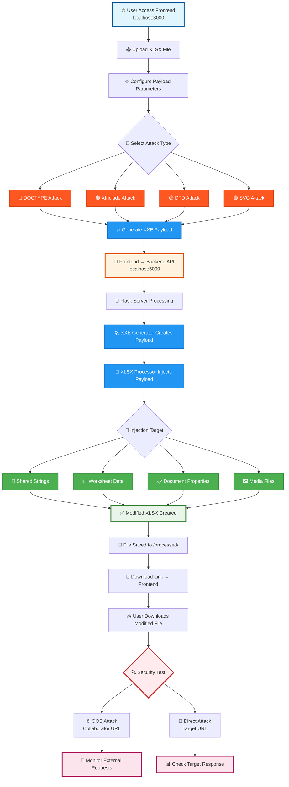

<div align="center">

# 🔥💀 XXE XLSX INJECTION TOOL 💀🔥


### 🎯💀 ADVANCED XXE PAYLOAD GENERATOR FOR XLSX FILES 💀🎯

**A powerful security testing tool that generates and injects XML External Entity (XXE) payloads into XLSX files. Features a React frontend for easy file upload and configuration, with a Flask backend that processes files and creates weaponized documents for authorized penetration testing and security research.**

<p align="center">
  <a href="#-quick-start"></a>
  <a href="#-features"></a>
  <a href="#-system-flowchart"></a>
  <a href="#-installation"></a>
  <a href="#-usage"></a>
</p>

</div>

---

<div align="center">

</div>

## 🌟💥 SUPER FEATURES 💥🌟

<table>
<tr>
<td width="50%">

### 🎯🔥 **ATTACK ARSENAL** 🔥🎯
- 🔴💥 **DOCTYPE Attack** - Classic XXE injection
- 🟠⚡ **XInclude Attack** - Advanced inclusion
- 🟡💀 **DTD Attack** - Document type definition
- 🟢🎨 **SVG Attack** - Scalable vector graphics

<div align="center">

</div>

</td>
<td width="50%">

### 🎯👾 **INJECTION TARGETS** 👾🎯
- 📝🔥 **Shared Strings** - Text content
- 📊⚡ **Worksheet Data** - Cell values
- 📋💀 **Document Properties** - Metadata
- 🖼️🎨 **Media Files** - Embedded content

<div align="center">

</div>

</td>
</tr>
</table>

<div align="center">

</div>

---

<div align="center">

</div>

## 📊🔥 SUPER SYSTEM FLOWCHART 🔥📊

<div align="center">


</div>



---

<div align="center">

</div>

## 🚀🔥 SUPER QUICK START 🔥🚀

<div align="center">


### 💻 PREREQUISITES ARSENAL 💻


</div>

---

<div align="center">

</div>

## ⚙️🔧 SUPER INSTALLATION GUIDE 🔧⚙️

<div align="center">


</div>

### 🐍🔥 BACKEND POWER SETUP 🔥🐍

<div align="center">

</div>

```bash
# 📁 Navigate to backend directory
cd backend

# 📦 Install Python dependencies
pip install -r requirements.txt
```

<div align="center">

</div>

### ⚛️🔥 FRONTEND POWER SETUP 🔥⚛️

<div align="center">

</div>

```bash
# 📁 Navigate to frontend directory
cd frontend

# 📦 Install Node.js dependencies
npm install
```

<div align="center">

</div>

---

<div align="center">

</div>

## 🏃‍♂️🔥 SUPER LAUNCH SEQUENCE 🔥🏃‍♂️

<div align="center">


</div>

<table>
<tr>
<td width="50%">

### 🔥🐍 START BACKEND POWER 🐍🔥
```bash
cd backend
python app.py
```
<div align="center">


</div>

</td>
<td width="50%">

### ⚡⚛️ START FRONTEND POWER ⚛️⚡
```bash
cd frontend
npm start
```
<div align="center">


</div>

</td>
</tr>
</table>

<div align="center">


</div>

---

<div align="center">

</div>

## 📖💀 SUPER USAGE GUIDE 💀📖

<div align="center">


### 🎯🔥 WEAPONIZATION PROCESS 🔥🎯

</div>

| Step | Action | Description | Status |
|------|--------|-------------|--------|
| 1️⃣ | **🌐 Access Tool** | Open `http://localhost:3000` in your browser | 🟢 Ready |
| 2️⃣ | **📤 Upload File** | Select and upload your target XLSX file | 🟡 Waiting |
| 3️⃣ | **⚙️ Configure** | Set payload parameters and attack type | 🟠 Config |
| 4️⃣ | **💥 Generate** | Create and inject XXE payloads | 🔴 Attack |
| 5️⃣ | **📥 Download** | Get your weaponized XLSX file | 🟢 Complete |

<div align="center">

</div>

### 🛠️💀 SUPER CONFIGURATION OPTIONS 💀🛠️

<table>
<tr>
<td>

**🌐💥 OOB ATTACKS 💥🌐**
- 🔗 Collaborator URL
- 🌐 External entity resolution
- 📡 Out-of-band data exfiltration

<div align="center">

</div>

</td>
<td>

**🎯🔥 DIRECT ATTACKS 🔥🎯**
- 🎯 Target URL specification
- 🔍 Internal network scanning
- 📁 Local file inclusion

<div align="center">

</div>

</td>
</tr>
</table>

<div align="center">

</div>

---

<div align="center">

</div>

## ⚠️💀 SUPER SECURITY WARNING 💀⚠️

<div align="center">

### 🚨🔥 FOR AUTHORIZED SECURITY TESTING ONLY 🔥🚨


**🔥 This tool is designed for legitimate security testing and research purposes. 🔥**

**💀 Only use on systems you own or have explicit permission to test. 💀**


</div>

---

<div align="center">

</div>

## 📁🏗️ SUPER PROJECT STRUCTURE 🏗️📁

<div align="center">


</div>

```
🏗️ xxe-xlsx-tool/
├── 🐍 backend/
│   ├── 🚀 app.py              # Flask API server
│   ├── 💥 xxe_generator.py    # XXE payload generator
│   ├── 📝 xlsx_processor.py   # XLSX file processor
│   └── 📋 requirements.txt    # Python dependencies
├── ⚛️ frontend/
│   ├── 📂 src/
│   │   ├── 🧩 components/     # React components
│   │   └── 📱 App.js         # Main application
│   └── 📦 package.json       # Node.js dependencies
└── 💾 processed/             # Output directory (auto-created)
```

<div align="center">

</div>

---

<div align="center">


### 🎉💀 HAPPY HACKING! 💀🎉


</div># XXE-XLSX-INJECTION-TOOL-

